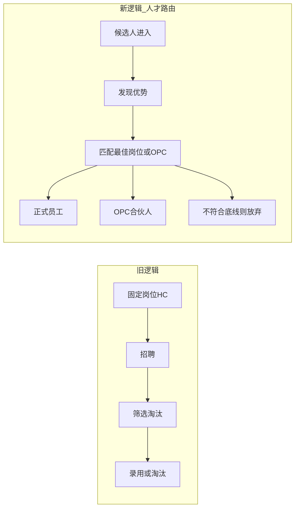
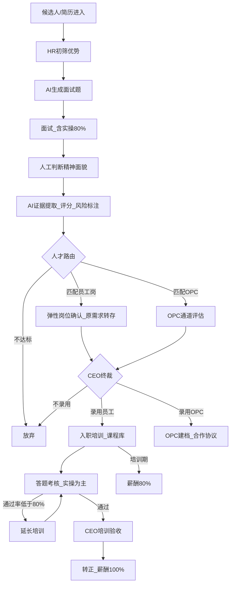
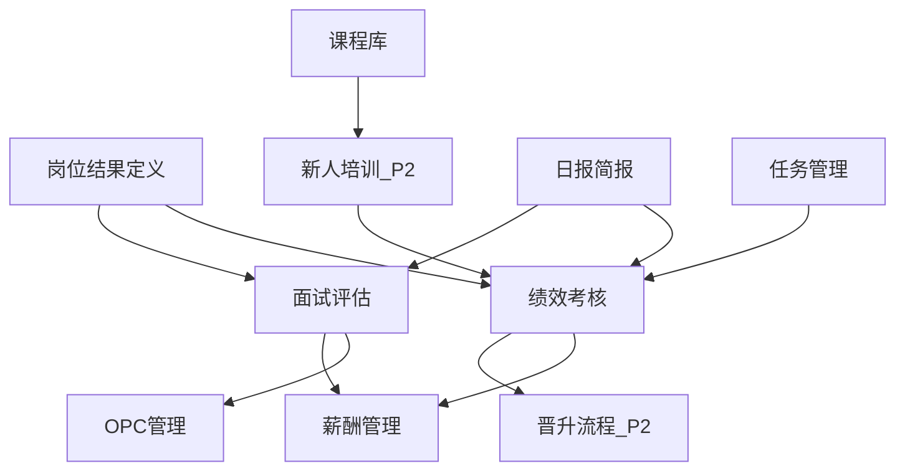
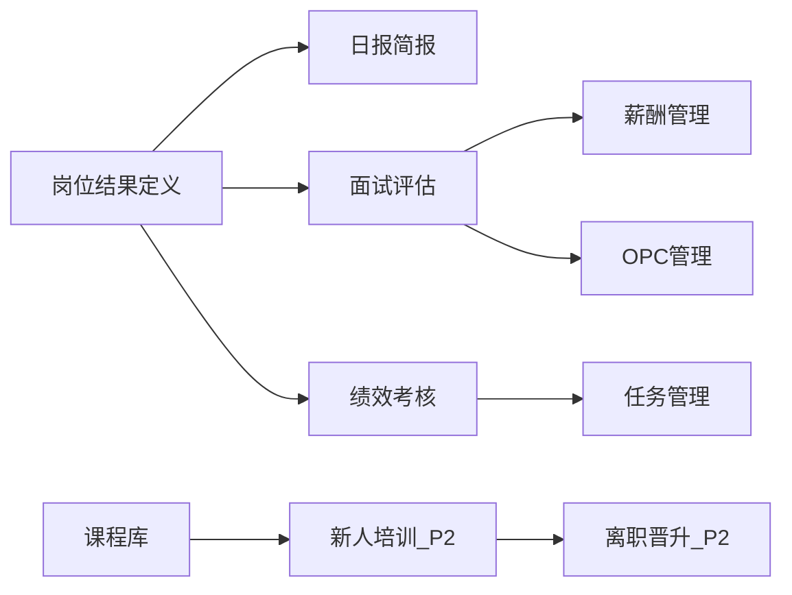

# 师选人才路由系统 — 产品需求文档（PRD）

---

## 1. 文档信息

| 项 | 内容 |
|---|---|
| **文档名称** | 师选人才路由系统 产品需求文档 |
| **版本** | v1.0 |
| **状态** | 待评审 |
| **创建日期** | 2026-06-09 |
| **产品负责人** | 余闻（营运经理/营运总监） |
| **目标读者** | CEO、营运经理、HR、技术总监、部门 Leader、研发、测试、软著申报 |

### 输入来源

- [docs/系统沟通记录.md](./系统沟通记录.md)（28 轮业务逻辑访谈，2026-06-08）

### 本文档范围

**写什么：**

- 产品定位、用户角色、业务流程、MVP 功能需求与用户故事
- 全能力远期规划（P2/P3）与开发优先级
- 可验收的非功能需求、DOD、风险与依赖
- 业务规则层面的计费/薪酬/考核规则（不含技术实现）

**不写什么：**

- 数据库设计、数据模型、字段类型、ER 图
- API 路径、接口设计、异步任务命名
- 页面路由清单、前端组件设计
- 状态机实现、代码枚举、技术常量名
- 微服务拆分、具体技术选型方案

### 变更记录

| 版本 | 日期 | 作者 | 变更说明 |
|------|------|------|----------|
| v1.0 | 2026-06-09 | PO | 初稿，基于系统沟通记录 v1.3 整理 |

---

## 2. 产品概述

### 2.1 背景

公司规模约 50 人，当前无独立 HR 管理系统，日常协同依赖飞书与飞书多维表格。HRBP 人效偏低，大量工作为重复劳动；更核心的问题是**用人标准模糊**——「能在公司体系里产出结果的人」 largely 依赖 HR 面试时的主观判断，缺乏可复用、可验收的标准化体系。

营运经理（余闻）作为 HRBP 自动化项目的验收方，需要每日掌握各业务线 HC 使用率、招聘进度与关键岗位候选人环节，但过去 HRBP 报告常被搁置。公司从事全国性 AI 培训业务，同时探索 OPC（合伙人）合作模式，人才来源与去向需更灵活。

### 2.2 产品定位

**师选人才路由系统**是一套面向内部 HR 场景的智能化人才管理平台，将传统「固定岗位 → 招聘 → 筛选淘汰」升级为**「候选人进入 → 发现优势 → 匹配最佳岗位或 OPC 合伙人 → 录用分流」**的人才路由逻辑，并贯通面试 → 培训 → 转正 → 薪酬全链路。

### 2.3 价值主张

| 维度 | 价值 |
|------|------|
| **提效** | 自动化日报、AI 辅助面试出题与分析、课程库调取，减少 HR 重复讲解与手工汇总 |
| **标准化** | 岗位结果定义、双维考核（会不会做 / 有没有产出），将「产出结果」从模糊口号变为可检查标准 |
| **决策赋能** | 证据提取 + 量化评分 + 风险标注，辅助 CEO 终裁；弹性岗位匹配，不放过符合底线的优秀人才 |
| **全链路** | 面试录用、培训状态、薪酬比例（80%/100%）、OPC 合作信息同一体系内可追溯 |

### 2.4 产品原则

1. **全链路优先**：面试 → 培训 → 转正 → 薪酬数据应可贯通，避免模块孤岛。
2. **证据驱动**：AI 面试评分采用透明推理，提供证据、分数与风险标注，供人决策而非替代人。
3. **人工 + AI 分工**：精神面貌、实操辅导、CEO 终裁由人完成；AI 承担重复性分析与初稿生成。
4. **岗位写结果**：每个关键模块有唯一主负责人；岗位定义须写清结果，而非仅职位名称。
5. **飞书优先**：日报、任务、课程库与现有飞书多维表格协同，降低迁移成本。

### 2.5 八项终局判断标准

方向清楚、岗位清楚、标准清楚、流程清楚、检查清楚、考核清楚、晋升清楚、复盘清楚。

### 2.6 产品边界

#### 做（MVP / Phase 1）

- 岗位结果定义
- 日报/简报自动化
- 面试评估（人才路由）
- 绩效考核（含任务管理）
- 薪酬管理（含 OPC 合作信息）
- 课程库（录屏存档与调取）
- OPC 合伙人信息管理

#### 不做（v1 明确排除）

- 用 AI 完全替代 HR 实操教学与人际沟通辅导
- AI 自动裁决候选人精神面貌
- 批量、低门槛发展 OPC 合伙人
- 对所有岗位（含设计岗、创新岗等）强制量化考核指标
- 替代飞书成为唯一协同平台（本期为增强而非替换）

#### 后续规划（P2/P3，见第 8 章）

- 新人培训完整编排、离职管理、考勤管理、晋升流程系统化、招聘/培训效果复盘、MBTI 测评深化、面试录音合规流程等

### 2.7 核心理念转变

---

## 3. 术语表

| 术语 | 定义 |
|------|------|
| **人才路由** | 根据候选人优势与公司需求，将其导向正式员工岗位、弹性岗位或 OPC 合伙人通道，而非单一固定 HC 筛选 |
| **OPC** | 合伙人合作模式；项目提成制，签合作协议，不交社保，系统内无考勤要求 |
| **弹性岗位** | 面试过程中可根据候选人优势调整岗位需求；原招聘需求须转存备查 |
| **转存招聘需求** | 当岗位需求因候选人优势而变更时，系统将原始需求存档，供后续追溯 |
| **证据提取** | AI 从简历、面试记录中提取支撑评分与优势判断的具体事实依据 |
| **风险标注** | AI 对候选人或匹配方案标注需人工关注的风险点（如技能短板、文化契合疑虑等） |
| **透明推理** | AI 评分须展示推理过程与依据，供 HR 与 CEO 审阅，非黑箱结论 |
| **能力考核** | 「会不会做」——考察员工是否掌握岗位所需技能（如能否做出标准海报） |
| **结果考核** | 「有没有产出」——考察工作带来的可量化结果（如新媒体 ROI） |
| **三讲明白** | 晋升或绩效考核时须向员工讲明白：规则、努力方向、努力后可获得什么 |
| **双通道职级** | 专业线（助理→专员→高级专员→专家→首席专家）与管理线（成员→小组负责人→项目负责人→部门负责人→合伙人型负责人），能力足够时可并行走 |
| **课程库** | 技术总监录屏及培训内容存档，可通过飞书多维表格按课程/技能调取视频地址 |
| **二级讲师** | 具备特定技能、可承担公开课或沙龙的内培讲师角色，降低外聘顶尖讲师成本 |
| **培训期/实习期** | 新人入职后学习与实操阶段，薪酬按基础薪资的 80% 计发 |
| **转正** | 培训与考核达标后，薪酬恢复 100% |
| **HC 使用率** | 各业务线编制（Headcount）实际占用与计划之比 |
| **日报/简报** | 每日自动生成的运营摘要：HC 使用率、招聘进度、关键岗候选人环节等 |
| **精神面貌** | 候选人或员工的状态、积极性、与公司同频程度，由人工实时判断，不由 AI 裁决 |
| **合伙人型负责人** | 管理线最高职级之一，与 OPC 合伙人为同一合作理念下的不同形态 |

---

## 4. 用户与角色

### 4.1 用户画像

| 角色 | 画像摘要 | 核心诉求 |
|------|----------|----------|
| **CEO** | 公司最高决策者 | 录用终裁、培训效果验收、晋升决策；全局经营与人才视图 |
| **营运经理/营运总监** | 余闻，兼营运管理与 HRBP 自动化验收 | 每日简报、招聘进度干预、晋升审批、实操延长评判、离职审核 |
| **HR** | 招聘、培训实操、标准制定 | 减少重复讲解、标准化面试与考核、专注实操辅导 |
| **技术总监** | 培训内容生产者 | 完成整体培训录屏后，由 HR 承接实操；内容进入课程库 |
| **部门 Leader** | 各业务部门负责人 | 本部门人员任务下发、绩效与薪酬 subset 查看 |
| **候选人/新人** | 应聘者或入职培训对象 | 清晰考核标准、课程学习、答题考核、任务落实 |
| **在职员工** | 已通过转正的员工 | 查看职级路径、任务、考核结果与三讲明白内容 |
| **OPC 合伙人** | 高门槛项目合作者 | 查看合作项目、分成比例、合作协议信息 |

### 4.2 角色权限矩阵（产品语言）

| 能力域 | CEO | 营运经理 | HR | 技术总监 | 部门 Leader | 员工/新人 | OPC |
|--------|-----|----------|-----|----------|-------------|-----------|-----|
| 日报/简报查看 | 全部 | 全部 | 相关业务线 | — | 本部门摘要 | — | — |
| 岗位结果定义 | 审批 | 查看 | 创建/维护 | 咨询 | 本部门岗位查看 | 本人岗位查看 | — |
| 面试评估 | 终裁 | 查看/批注 | 执行/录入 | — | 本部门岗位候选人 | — | — |
| 课程库 | 查看 | 查看 | 维护/调取 | 上传录屏 | 按授权查看 | 学习调取 | — |
| 培训/答题 | 验收 | 实操延长评判 | 讲解/实操 | 内容生产 | — | 参与 | — |
| 绩效考核 | 查看 | 查看/审批 | 创建标准/录入 | — | 本部门考核 | 本人查看 | — |
| 任务管理 | 查看 | 查看 | 创建 | — | 创建/检查 | 接收/完成 | — |
| 薪酬数据 | 全部 | 全部 | 录入/维护 | — | 本部门 | 本人基础信息 | 本人 OPC 分成 |
| OPC 管理 | 全部 | 全部 | 维护 | — | 相关项目 | — | 本人 |
| 晋升审批 | 决策 | 审批 | 提名/标准 | — | 提名 | 查看进度 | — |
| 离职管理（P2） | 审核 | 审核 | 办理 | — | 本部门申请 | 申请 | — |

> **说明**：营运经理与营运总监为同一人（余闻）。薪酬为敏感数据，部门 Leader 仅可见本部门 subset。

---

## 5. 产品架构

### 5.1 功能模块清单

| 模块 | Phase | 说明 |
|------|-------|------|
| 岗位结果定义 | MVP | 系统地基；岗位须写清结果与主负责人 |
| 日报/简报 | MVP | 每日 HC、招聘进度、关键岗环节 |
| 面试评估（人才路由） | MVP | 优势提取、岗位/OPC 匹配、AI 评分 |
| 课程库 | MVP | 录屏存档、多维表格调取、视频地址 |
| 绩效考核 | MVP | 双维考核、量化指标、三讲明白展示 |
| 任务管理 | MVP | 日任务创建、落实、完成检查 |
| 薪酬管理 | MVP | 培训/转正比例、OPC 分成、审核流 |
| OPC 管理 | MVP | 合伙人信息、项目、分成、协议 |
| 新人培训编排 | P2 | AI 答题 80%、培训延长、CEO 验收 |
| 离职管理 | P2 | 申请、审批、交接、结算 |
| 晋升流程 | P2 | 提名→审批→CEO 决策→培训 |
| 招聘/培训复盘 | P2 | 质量与效果回顾 |
| 考勤管理 | P3 | 正式员工考勤（规则待确认） |
| MBTI 测评 | P2 | 候选人基础测评维度 |

### 5.2 核心业务流程

### 5.3 模块依赖关系

---

## 6. 用户旅程

### 6.1 主旅程：候选人到转正员工

| 阶段 | 用户行为 | 触点功能 | 完成标志 |
|------|----------|----------|----------|
| 1. 简历进入 | HR 阅读简历，标记优势与培养方向 | 面试评估、岗位结果定义 | 候选人建档，优势初筛完成 |
| 2. AI 辅助准备 | HR 发起 AI 出题 | 面试评估（AI 出题） | 基于简历+岗位的面试题/实操题就绪 |
| 3. 面试执行 | HR 组织面试，人工判断精神面貌 | 面试记录、精神面貌人工标注 | 面试录音/记录存档 |
| 4. AI 分析 | 系统结构化分析，输出评分与路由建议 | 证据提取、量化评分、风险标注 | CEO/HR 可查看透明推理报告 |
| 5. 人才路由 | 系统推荐最佳岗位或 OPC；可弹性调整岗位 | 人才路由、转存招聘需求 | 路由方案待 CEO 审阅 |
| 6. CEO 决策 | CEO 终裁录用去向 | 录用审批 | 录用/不录用/OPC 结论 |
| 7. 入职培训 | 新人通过课程库学习，HR 实操辅导 | 课程库、培训状态 | 培训期薪酬 80% 生效 |
| 8. 考核过关 | 新人完成答题（实操 80%+选择 20%），正确率 ≥80% | 答题考核（P2 完整编排） | 考核通过 |
| 9. 转正 | CEO 验收培训效果 | 培训验收、薪酬状态 | 薪酬恢复 100% |

### 6.2 营运经理旅程：每日经营掌控

| 阶段 | 用户行为 | 触点功能 | 完成标志 |
|------|----------|----------|----------|
| 1. 早间查看 | 打开飞书查看日报 | 日报/简报 | 看到各业务线 HC 使用率、招聘进度 |
| 2. 关键岗跟进 | 查看关键岗位候选人所处环节 | 日报、面试评估 | 识别卡点候选人 |
| 3. 夜间批注 | 头晚对日报做批注（材料意向） | 日报批注 | 批注留存，HR 次日可跟进 |
| 4. 决策干预 | 对招聘瓶颈、绩效异常采取行动 | 面试评估、绩效考核 | 问题有责任人跟进 |

### 6.3 HR 旅程：从招聘到标准维护

| 阶段 | 用户行为 | 触点功能 | 完成标志 |
|------|----------|----------|----------|
| 1. 标准维护 | 维护岗位结果定义与考核模板 | 岗位结果定义、绩效考核 | HR/市场/财务等岗位有量化模板 |
| 2. 招聘执行 | 初筛、面试、录入结果 | 面试评估 | 候选人全流程可查 |
| 3. 培训辅导 | 技术总监录屏后，HR 讲解实操 | 课程库 | 新人可调取对应技能课程 |
| 4. 任务与考核 | 创建或协同部门 Leader 下发日任务 | 任务管理、绩效考核 | 员工任务落实可检查 |
| 5. 三讲明白 | 晋升或绩效周期向员工讲解规则与收益 | 绩效考核、个人页面 | 员工可见规则与努力方向 |

---

## 7. MVP 功能需求

> **说明**：沟通记录提及日报「已开发」，本期 PRD 仍按完整可验收需求描述，便于软著申报、产品评审与测试验收对齐。

---

### 7.1 岗位结果定义

#### 功能说明

- **做什么**：为每个岗位定义「结果导向」的描述——不只写职位名称，须写清预期产出、主负责人、协作人、完成标准与检查人。
- **边界**：MVP 先覆盖 HR、市场部、财务等可量化部门；设计岗、创新岗等可暂不强制量化，标注例外。
- **依赖**：面试匹配、绩效考核、任务管理均依赖本模块，**须优先于其他模块就绪**。

#### 用户故事

**US-001**

> 我作为一个 **HR**，通过使用 **岗位结果定义创建功能**，以达到 **将「岗位写结果」从口号落地为可维护标准** 的目的。

- [ ] **前提**：HR 已登录且有岗位定义维护权限
- [ ] **操作**：新建岗位，填写岗位名称、预期结果、主负责人、协作人、完成标准、检查人
- [ ] **结果**：岗位定义保存成功，可在面试与绩效模块中被引用

**US-002**

> 我作为一个 **部门 Leader**，通过使用 **本部门岗位结果查看功能**，以达到 **清楚本部门每个岗位应产出什么结果** 的目的。

- [ ] **前提**：岗位已归属本部门且已发布
- [ ] **操作**：进入部门岗位列表，查看岗位结果定义详情
- [ ] **结果**：可见预期结果、负责人与完成标准，内容与 HR 维护一致

**US-003**

> 我作为一个 **营运经理**，通过使用 **全公司岗位结果总览**，以达到 **检查各业务线岗位定义是否完整、责任是否清晰** 的目的。

- [ ] **前提**：至少一个业务线已录入岗位定义
- [ ] **操作**：查看各业务线岗位定义完整度与主负责人覆盖情况
- [ ] **结果**：可识别未定义结果或未指定主负责人的岗位清单

**US-004**

> 我作为一个 **HR**，通过使用 **岗位量化考核指标模板关联**，以达到 **为 HR/市场/财务等岗位自动生成可检查的考核依据** 的目的。

- [ ] **前提**：岗位结果定义已创建，且该岗位属于支持量化模板的部门
- [ ] **操作**：为岗位关联或生成量化考核指标模板（如 ROI、执行落地率等）
- [ ] **结果**：模板与岗位绑定，绩效考核模块可引用

**US-005**

> 我作为一个 **员工**，通过使用 **个人岗位结果查看**，以达到 **知道自己岗位要产出什么、由谁检查** 的目的。

- [ ] **前提**：员工已分配岗位且岗位定义已发布
- [ ] **操作**：在个人页面查看本岗位结果定义
- [ ] **结果**：可见预期结果、完成标准与检查人信息

---

### 7.2 日报/简报

#### 功能说明

- **做什么**：每日自动生成经营简报，包含各业务线 HC 使用率、招聘进度、关键岗位候选人环节；支持飞书查看；支持头晚批注（材料意向）。
- **边界**：聚焦 actionable 信息，避免营运经理不看的「无用报告」；不替代深度复盘（复盘见 P2）。
- **验收角色**：营运经理为首要验收人。

#### 用户故事

**US-006**

> 我作为一个 **营运经理**，通过使用 **每日自动简报**，以达到 **早上打开飞书即可掌握各业务线人力与招聘状况、无需催 HRBP** 的目的。

- [ ] **前提**：业务线、HC、招聘数据已在系统内维护
- [ ] **操作**：每日早间在飞书打开自动生成的日报
- [ ] **结果**：可见各业务线 HC 使用率、招聘进度、关键岗候选人当前环节

**US-007**

> 我作为一个 **CEO**，通过使用 **日报全局视图**，以达到 **快速了解公司整体招聘与编制健康度** 的目的。

- [ ] **前提**：日报已按日程生成
- [ ] **操作**：查看日报全局汇总
- [ ] **结果**：可见全公司 HC 与招聘进度摘要，可下钻至业务线

**US-008**

> 我作为一个 **营运经理**，通过使用 **日报关键岗位候选人环节追踪**，以达到 **识别招聘卡点并及时干预** 的目的。

- [ ] **前提**：存在进行中的关键岗位招聘
- [ ] **操作**：在日报中查看关键岗候选人名单及其所处环节（如初筛/面试/待 CEO 决策等）
- [ ] **结果**：每位关键岗候选人环节清晰，卡点候选人可识别

**US-009**

> 我作为一个 **营运经理**，通过使用 **日报批注功能**，以达到 **对头晚简报留下决策意见供 HR 次日跟进** 的目的。

- [ ] **前提**：当日日报已生成
- [ ] **操作**：在日报上添加批注（材料意向：头晚批注）
- [ ] **结果**：批注保存并关联当日日报，HR 可查看

**US-010**

> 我作为一个 **HR**，通过使用 **日报批注查看**，以达到 **按营运经理意见调整招聘跟进优先级** 的目的。

- [ ] **前提**：营运经理已对日报批注
- [ ] **操作**：查看日报及关联批注
- [ ] **结果**：可见批注内容与对应业务线/候选人，可据此跟进

**US-011**

> 我作为一个 **部门 Leader**，通过使用 **本部门日报摘要**，以达到 **了解本部门编制使用与招聘进展** 的目的。

- [ ] **前提**：部门 Leader 权限已配置
- [ ] **操作**：查看本部门日报摘要
- [ ] **结果**：仅可见本部门 HC 使用率与招聘进度，不可见其他部门薪酬等敏感数据

---

### 7.3 面试评估（人才路由）

#### 功能说明

- **做什么**：从「筛选淘汰」升级为「人才路由」——提取候选人优势，匹配最佳岗位或 OPC；AI 提供证据提取、量化评分、风险标注与透明推理；支持基于简历+岗位自动生成面试题（偏实操）；弹性岗位时转存原招聘需求；CEO 终裁。
- **边界**：精神面貌由人工实时判断；AI 评分为参考而非自动录用；口才好技术一般等情形可路由至二级讲师等弹性岗位。
- **业务规则**：
  - 面试题：实操为主（约 80%），选择题约 20%
  - 面试录音可存档并结构化分析（合规流程见 P2）
  - 双人竞争等复杂情形由 CEO 拍板
  - OPC 门槛：本科以上 + 精神面貌好 + 某项优势数一数二（不批量发展）

#### 用户故事

**US-012**

> 我作为一个 **HR**，通过使用 **候选人建档与简历优势初筛**，以达到 **在面试前标记候选人技能与培养方向** 的目的。

- [ ] **前提**：候选人简历已录入
- [ ] **操作**：阅读简历，录入或确认优势标签与培养方向
- [ ] **结果**：候选人档案含优势初筛记录，可供 AI 与后续路由使用

**US-013**

> 我作为一个 **HR**，通过使用 **AI 面试题生成**，以达到 **基于简历与岗位快速获得实操导向的面试题** 的目的。

- [ ] **前提**：候选人已关联目标岗位，岗位结果定义存在
- [ ] **操作**：发起 AI 出题，审阅生成题目
- [ ] **结果**：获得基于简历+岗位的面试题列表，实操题占比约 80%

**US-014**

> 我作为一个 **HR**，通过使用 **面试记录与录音存档**，以达到 **保留面试全过程证据供后续分析** 的目的。

- [ ] **前提**：面试正在进行或已完成
- [ ] **操作**：录入或上传面试记录/录音
- [ ] **结果**：面试原文或录音关联候选人档案，可供 AI 分析

**US-015**

> 我作为一个 **HR**，通过使用 **精神面貌人工标注**，以达到 **记录候选人与公司同频程度供决策参考** 的目的。

- [ ] **前提**：面试已完成，HR 在场观察
- [ ] **操作**：对候选人精神面貌进行人工标注与备注
- [ ] **结果**：精神面貌评价存入档案，系统不自动覆盖或改写人工结论

**US-016**

> 我作为一个 **HR**，通过使用 **AI 结构化面试分析**，以达到 **将面试录音/记录转化为可审阅的分析报告** 的目的。

- [ ] **前提**：面试记录或录音已存档
- [ ] **操作**：触发 AI 结构化分析
- [ ] **结果**：产出含优势提取、技能评估、风险点的分析报告

**US-017**

> 我作为一个 **HR**，通过使用 **AI 证据提取与量化评分**，以达到 **用具体事实支撑评分而非纯主观印象** 的目的。

- [ ] **前提**：AI 分析已完成
- [ ] **操作**：查看评分及每条分数对应的证据摘录
- [ ] **结果**：评分可追溯至简历或面试中的具体陈述/表现

**US-018**

> 我作为一个 **CEO**，通过使用 **AI 透明推理报告**，以达到 **理解 AI 为何给出某路由建议并做出终裁** 的目的。

- [ ] **前提**：候选人已完成面试与 AI 分析
- [ ] **操作**：查看含推理过程、证据、评分、风险标注的完整报告
- [ ] **结果**：可理解 AI 建议逻辑，并在此基础上做出录用/不录用/OPC 决策

**US-019**

> 我作为一个 **HR**，通过使用 **人才路由与最佳岗位匹配**，以达到 **根据候选人优势推荐最合适的员工岗位** 的目的。

- [ ] **前提**：候选人优势与岗位库已维护
- [ ] **操作**：查看系统路由建议（含匹配岗位与理由）
- [ ] **结果**：展示最佳匹配岗位及优势对齐说明，供 CEO 审阅

**US-020**

> 我作为一个 **HR**，通过使用 **OPC 通道推荐**，以达到 **将高优势但无固定 HC 的候选人导向合伙人合作** 的目的。

- [ ] **前提**：候选人满足 OPC 高门槛（待运营确认细则）
- [ ] **操作**：查看 OPC 路由建议及合作方向
- [ ] **结果**：展示 OPC 匹配方案与项目合作意向，供 CEO 审阅

**US-021**

> 我作为一个 **HR**，通过使用 **弹性岗位调整与招聘需求转存**，以达到 **根据候选人优势调整岗位并不丢失原始需求** 的目的。

- [ ] **前提**：面试中发现候选人优势与原岗位不完全匹配
- [ ] **操作**：调整岗位需求，系统自动转存原始招聘需求
- [ ] **结果**：新岗位需求生效，原需求可在档案中追溯

**US-022**

> 我作为一个 **CEO**，通过使用 **录用终裁**，以达到 **对候选人去留及员工/OPC 分流做最终决策** 的目的。

- [ ] **前提**：面试评估与路由建议已完成
- [ ] **操作**：做出录用、不录用、录用为员工或录用为 OPC 的终裁
- [ ] **结果**：决策记录存档，触发后续培训入职或 OPC 建档流程

**US-023**

> 我作为一个 **营运经理**，通过使用 **面试进度查看**，以达到 **在日报之外深入查看招聘管道详情** 的目的。

- [ ] **前提**：有进行中的招聘
- [ ] **操作**：查看各岗位候选人管道与环节停留时长
- [ ] **结果**：可见招聘漏斗与各候选人当前状态

---

### 7.4 课程库

#### 功能说明

- **做什么**：管理技术总监录屏及培训内容；支持通过飞书多维表格按课程/技能/客户沟通问题等维度调取；自动提取视频地址供学习使用。
- **边界**：MVP 聚焦存档、索引与调取；完整培训编排（答题、延长、CEO 验收联动）见 P2；技术总监完成整体录屏后由 HR 承接实操。
- **维护**：课程库日常维护责任人——**待运营确认**。

#### 用户故事

**US-024**

> 我作为一个 **技术总监**，通过使用 **培训录屏上传与归档**，以达到 **将整体培训内容沉淀为可复用课程** 的目的。

- [ ] **前提**：培训录屏文件已制作完成
- [ ] **操作**：上传录屏并填写课程名称、技能标签、适用对象
- [ ] **结果**：课程进入课程库，可在多维表格与系统内检索

**US-025**

> 我作为一个 **HR**，通过使用 **课程库多维表格检索**，以达到 **按技能或客户沟通场景快速定位对应课程** 的目的。

- [ ] **前提**：课程库已与飞书多维表格协同
- [ ] **操作**：在多维表格中按课程、技能或场景筛选
- [ ] **结果**：返回匹配课程列表及关联信息

**US-026**

> 我作为一个 **HR**，通过使用 **课程视频地址自动提取**，以达到 **在培训新人时直接调取视频而无需手工找链接** 的目的。

- [ ] **前提**：目标课程已入库
- [ ] **操作**：选择课程，获取视频播放地址
- [ ] **结果**：系统返回可用视频地址，新人或 HR 可直接使用

**US-027**

> 我作为一个 **新人**，通过使用 **按技能学习路径调取课程**，以达到 **针对自身薄弱技能学习对应录屏内容** 的目的。

- [ ] **前提**：新人已分配培训计划或技能清单
- [ ] **操作**：按技能标签浏览并打开课程
- [ ] **结果**：可观看与当前技能对应的培训视频

**US-028**

> 我作为一个 **营运经理**，通过使用 **课程库覆盖度查看**，以达到 **确认各关键技能是否均有培训课程覆盖** 的目的。

- [ ] **前提**：课程库已有一定存量
- [ ] **操作**：查看技能标签与课程覆盖矩阵
- [ ] **结果**：可识别无课程覆盖的技能缺口

**US-029**

> 我作为一个 **HR**，通过使用 **课程与培训状态关联**，以达到 **在辅导新人时知道其应完成哪些课程** 的目的。

- [ ] **前提**：新人已录用并进入培训期
- [ ] **操作**：为新人关联必修课程清单
- [ ] **结果**：新人培训状态与课程清单绑定，可追踪完成进度

---

### 7.5 绩效考核

#### 功能说明

- **做什么**：双维考核——能力考核（会不会做）与结果考核（有没有产出）；支持 HR/市场/财务等岗位量化指标；晋升与绩效时触发「三讲明白」；与岗位结果定义、任务管理联动。
- **边界**：并非所有岗位强制量化；职级晋升具体条件**待一次性建立**（P2 完善）。

#### 用户故事

**US-030**

> 我作为一个 **HR**，通过使用 **能力考核标准定义**，以达到 **明确「会不会做」的检查方式** 的目的。

- [ ] **前提**：岗位结果定义已存在
- [ ] **操作**：为岗位定义能力考核项（如「能否做出标准海报」）及评判标准
- [ ] **结果**：能力考核标准发布，可在考核时引用

**US-031**

> 我作为一个 **HR**，通过使用 **结果考核标准定义**，以达到 **明确「有没有产出」的量化指标** 的目的。

- [ ] **前提**：岗位属于可量化部门（如新媒体运营）
- [ ] **操作**：定义结果指标（如 ROI、平台数据等）及目标值
- [ ] **结果**：结果考核标准发布，与岗位绑定

**US-032**

> 我作为一个 **部门 Leader**，通过使用 **员工能力考核执行**，以达到 **检查下属是否掌握岗位所需技能** 的目的。

- [ ] **前提**：能力考核标准已定义，考核周期已到
- [ ] **操作**：按标准执行能力考核并录入结果
- [ ] **结果**：员工能力考核记录存档，员工可查看

**US-033**

> 我作为一个 **部门 Leader**，通过使用 **员工结果考核录入**，以达到 **记录下属实际产出与目标对比** 的目的。

- [ ] **前提**：结果考核标准已定义
- [ ] **操作**：录入周期内实际产出数据与考核结论
- [ ] **结果**：结果考核记录存档，可汇总至日报或绩效视图

**US-034**

> 我作为一个 **员工**，通过使用 **个人考核结果查看**，以达到 **了解自己在能力与结果两维的表现** 的目的。

- [ ] **前提**：考核已完成并发布
- [ ] **操作**：在个人页面查看能力考核与结果考核结果
- [ ] **结果**：可见两维得分/结论及检查人反馈

**US-035**

> 我作为一个 **员工**，通过使用 **三讲明白展示**，以达到 **在绩效或晋升时清楚规则、努力方向与可得收益** 的目的。

- [ ] **前提**：绩效周期或晋升流程已触发三讲明白
- [ ] **操作**：在个人页面或飞书多维表格查看三讲明白内容
- [ ] **结果**：可见规则说明、努力方向描述、达成后可获得的收益

**US-036**

> 我作为一个 **HR**，通过使用 **考核指标模板批量应用**，以达到 **为 HR/市场/财务岗位快速生成量化考核体系** 的目的。

- [ ] **前提**：部门岗位清单已维护
- [ ] **操作**：选择模板批量关联至部门岗位
- [ ] **结果**：多个岗位考核指标一次性配置完成

**US-037**

> 我作为一个 **营运经理**，通过使用 **全公司绩效异常概览**，以达到 **发现产出持续偏低的岗位或人员** 的目的。

- [ ] **前提**：至少一个考核周期有数据
- [ ] **操作**：查看绩效异常汇总（如连续未达标）
- [ ] **结果**：可识别需干预的部门、岗位或人员清单

**US-038**

> 我作为一个 **CEO**，通过使用 **绩效与招聘质量关联视图**，以达到 **判断用人标准与实际产出是否匹配** 的目的。

- [ ] **前提**：面试录用与绩效数据已贯通
- [ ] **操作**：查看按招聘批次或岗位汇总的绩效表现
- [ ] **结果**：可对比不同来源候选人的后续产出（P2 复盘深化）

**US-039**

> 我作为一个 **HR**，通过使用 **双通道职级信息展示**，以达到 **让员工了解专业线与管理线发展路径** 的目的。

- [ ] **前提**：职级体系框架已配置
- [ ] **操作**：维护并发布双通道职级说明
- [ ] **结果**：员工可在个人页面查看专业线与管理线职级路径

---

### 7.6 任务管理

#### 功能说明

- **做什么**：支持 HR 或部门 Leader 创建日任务；与飞书自动化协同下发；任务落实后可检查；业务规则：当日任务落实完毕方可下班（材料意向）。
- **边界**：MVP 实现任务创建、下发、状态追踪与检查；与办公室白板落实的线下环节可并行，系统记录为权威状态源之一。

#### 用户故事

**US-040**

> 我作为一个 **部门 Leader**，通过使用 **日任务创建**，以达到 **向团队成员明确当日必须完成的工作** 的目的。

- [ ] **前提**：Leader 已登录且有本部门任务权限
- [ ] **操作**：创建任务，填写负责人、协作人、截止时间、完成标准、检查人
- [ ] **结果**：任务创建成功，负责人收到通知（含飞书协同）

**US-041**

> 我作为一个 **HR**，通过使用 **跨部门任务创建**，以达到 **协调需要 HR 参与的共性任务** 的目的。

- [ ] **前提**：HR 有任务创建权限
- [ ] **操作**：创建任务并指定负责人与检查人
- [ ] **结果**：任务进入任务列表，相关人员可见

**US-042**

> 我作为一个 **员工**，通过使用 **日任务接收与完成确认**，以达到 **落实当日工作并标记完成** 的目的。

- [ ] **前提**：员工已收到当日任务
- [ ] **操作**：执行任务并在系统中标记完成，提交检查结果
- [ ] **结果**：任务状态更新为已完成或待检查

**US-043**

> 我作为一个 **部门 Leader**，通过使用 **任务完成检查**，以达到 **确认下属当日任务是否达到完成标准** 的目的。

- [ ] **前提**：员工已提交任务完成
- [ ] **操作**：按完成标准检查并确认或退回
- [ ] **结果**：任务检查结果存档，未通过任务保持 open 状态

**US-044**

> 我作为一个 **员工**，通过使用 **当日任务完成状态查看**，以达到 **确认自己是否满足当日工作落实要求** 的目的。

- [ ] **前提**：当日有分配任务
- [ ] **操作**：查看个人当日任务列表及完成状态
- [ ] **结果**：清晰知晓哪些任务已完成、哪些仍 open

**US-045**

> 我作为一个 **营运经理**，通过使用 **任务落实率概览**，以达到 **了解各部门日任务执行文化是否到位** 的目的。

- [ ] **前提**：任务模块已运行至少一个工作日
- [ ] **操作**：查看各部门任务完成率与逾期情况
- [ ] **结果**：可识别落实率偏低的部门

---

### 7.7 薪酬管理

#### 功能说明

- **做什么**：管理员工薪酬状态与培训/转正比例（培训期/实习期 80%，转正 100%）；OPC 项目提成与合作协议信息；薪酬数据从零建立，前期可半成品上线；完成后须有负责人审核（负责人**待确认**）。
- **边界**：基础薪资结构**待运营确认**；无历史数据可导入；部门 Leader 仅见本部门 subset。

#### 用户故事

**US-046**

> 我作为一个 **HR**，通过使用 **员工薪酬档案建立**，以达到 **从零开始维护员工基础薪酬信息** 的目的。

- [ ] **前提**：员工已录用或已在职
- [ ] **操作**：录入员工基础薪资结构（结构细则待运营确认）
- [ ] **结果**：薪酬档案创建，关联员工身份

**US-047**

> 我作为一个 **HR**，通过使用 **培训期薪酬比例设置**，以达到 **将培训/实习期员工薪酬自动按 80% 计发** 的目的。

- [ ] **前提**：员工处于培训期或实习期
- [ ] **操作**：将员工薪酬状态设为培训期
- [ ] **结果**：系统按 80% 比例展示/计算应发薪酬

**US-048**

> 我作为一个 **HR**，通过使用 **转正薪酬状态变更**，以达到 **员工培训验收通过后恢复 100% 薪酬** 的目的。

- [ ] **前提**：员工培训考核通过且 CEO 验收（P2 联动）
- [ ] **操作**：将员工状态从培训期变更为转正
- [ ] **结果**：薪酬比例更新为 100%，变更记录可审计

**US-049**

> 我作为一个 **CEO**，通过使用 **全公司薪酬数据查看**，以达到 **掌握公司整体薪酬状况** 的目的。

- [ ] **前提**：CEO 权限已配置，薪酬数据已录入
- [ ] **操作**：查看全公司薪酬汇总与明细
- [ ] **结果**：可见全部员工薪酬状态，部门 Leader 不可见此视图

**US-050**

> 我作为一个 **部门 Leader**，通过使用 **本部门薪酬 subset 查看**，以达到 **了解本部门员工薪酬状态而不越权** 的目的。

- [ ] **前提**：部门 Leader 权限已配置
- [ ] **操作**：查看本部门员工薪酬状态
- [ ] **结果**：仅可见本部门数据，不可见其他部门

**US-051**

> 我作为一个 **HR**，通过使用 **薪酬数据审核提交**，以达到 **薪酬录入完成后提交负责人审核** 的目的。

- [ ] **前提**：薪酬档案已录入，审核负责人已配置（待确认）
- [ ] **操作**：提交薪酬数据供审核
- [ ] **结果**：审核状态变更，负责人收到待审通知

**US-052**

> 我作为一个 **营运经理**，通过使用 **薪酬审核**，以达到 **确保薪酬数据准确后生效** 的目的。

- [ ] **前提**：有待审核的薪酬数据
- [ ] **操作**：审阅并批准或驳回薪酬录入
- [ ] **结果**：审核结论存档，通过后数据正式生效

**US-053**

> 我作为一个 **员工**，通过使用 **个人薪酬状态查看**，以达到 **了解当前薪酬比例与培训/转正状态** 的目的。

- [ ] **前提**：员工薪酬档案已建立
- [ ] **操作**：在个人页面查看薪酬状态
- [ ] **结果**：可见当前为培训期 80% 或转正 100%，不含他人数据

---

### 7.8 OPC 管理

#### 功能说明

- **做什么**：管理 OPC 合伙人信息——联系方式、合作项目、分成比例、合作协议；无社保、无考勤；高门槛精选，不批量发展。
- **边界**：OPC 薪酬以项目提成为主；考勤模块不适用于 OPC。

#### 用户故事

**US-054**

> 我作为一个 **HR**，通过使用 **OPC 合伙人建档**，以达到 **为通过 OPC 通道录用的人才建立合作档案** 的目的。

- [ ] **前提**：CEO 已做出 OPC 录用决策
- [ ] **操作**：录入 OPC 基本信息、联系方式、技能优势
- [ ] **结果**：OPC 档案创建，与面试路由记录关联

**US-055**

> 我作为一个 **HR**，通过使用 **OPC 合作项目与分成配置**，以达到 **明确每个合作项目的分成比例** 的目的。

- [ ] **前提**：OPC 档案已存在
- [ ] **操作**：添加合作项目及分成比例
- [ ] **结果**：项目与分成信息保存，OPC 可查看本人相关项目

**US-056**

> 我作为一个 **HR**，通过使用 **OPC 合作协议管理**，以达到 **留存合伙人合作协议供查阅** 的目的。

- [ ] **前提**：OPC 合作已达成
- [ ] **操作**：上传或关联合作协议
- [ ] **结果**：协议与 OPC 档案绑定，CEO/营运经理可查阅

**US-057**

> 我作为一个 **OPC 合伙人**，通过使用 **个人合作信息查看**，以达到 **了解自己参与的项目与分成** 的目的。

- [ ] **前提**：OPC 账号已开通
- [ ] **操作**：查看本人合作项目、分成比例、协议摘要
- [ ] **结果**：仅可见本人 OPC 信息，不可见员工薪酬与考勤

**US-058**

> 我作为一个 **CEO**，通过使用 **OPC 合伙人总览**，以达到 **掌握高价值合伙人资源与项目分布** 的目的。

- [ ] **前提**：已有 OPC 档案
- [ ] **操作**：查看 OPC 名单、项目分布与分成汇总
- [ ] **结果**：可见全部 OPC 合作概况，支持决策是否新增合作

---

## 8. 全能力规划（P2/P3）

> 以下能力来自沟通记录中的远期目标与投标级全能力描述，**不等于 v1 必做**。

### 8.1 P2 规划

| 能力 | 说明 | 关键业务规则 |
|------|------|--------------|
| **新人培训完整编排** | AI 答题（实操 80%+选择 20%）、培训延长、CEO 验收 | 答题正确率 ≥80% 过关；未通过延长培训直至完成；不配合学习可开除（**劳动法合规待法务确认**） |
| **离职管理** | 申请、审批、交接、结算 | 离职审核：CEO + 营运经理 |
| **晋升流程系统化** | 提名→营运经理审批→CEO 决策→培训 | 各职级晋升条件待一次性建立 |
| **招聘/培训效果复盘** | 招聘质量与培训效果回顾 | 非日常运营复盘；标准由 HR 给出 |
| **MBTI 测评** | 候选人基础人格测评维度 | 辅助路由，不替代面试判断 |
| **面试录音合规** | 告知、授权、留存规范 | 待运营/法务确认 |

### 8.2 P3 规划

| 能力 | 说明 |
|------|------|
| **考勤管理** | 正式员工考勤规则**待确认**；OPC 明确无考勤 |
| **晋升条件库** | 各职级量化晋升条件一次性建立并系统化 |
| **深度复盘看板** | 跨周期招聘 ROI、培训周期缩短（30 天→15 天）效果追踪 |

### 8.3 P2 用户故事示例（规划态，不含完整 DOD）

以下故事在 P2 阶段须补充完整 DOD 后纳入迭代：

- 我作为一个 **新人**，通过使用 **AI 答题考核**，以达到 **检验培训掌握程度并决定是否延长培训** 的目的。
- 我作为一个 **CEO**，通过使用 **培训效果验收**，以达到 **确认新人可独立工作并批准转正** 的目的。
- 我作为一个 **员工**，通过使用 **离职申请**，以达到 **按规定发起离职并完成交接** 的目的。
- 我作为一个 **HR**，通过使用 **晋升提名**，以达到 **将符合项目输出与能力的员工推向晋升流程** 的目的。

---

## 9. 开发优先级总表

### 9.1 MVP vs 全能力对照

| 模块 | MVP (Phase 1) | P2 | P3 |
|------|---------------|-----|-----|
| 岗位结果定义 | ✅ 必做 | 扩展例外岗位 | — |
| 日报/简报 | ✅ 必做 | 批注增强 | — |
| 面试评估 | ✅ 必做 | 录音合规、MBTI | — |
| 课程库 | ✅ 必做（存档调取） | 培训编排联动 | — |
| 绩效考核 | ✅ 必做 | 晋升联动 | 深度复盘 |
| 任务管理 | ✅ 必做 | — | — |
| 薪酬管理 | ✅ 必做（可半成品） | 审核流完善 | — |
| OPC 管理 | ✅ 必做 | — | — |
| 新人培训编排 | — | ✅ | — |
| 离职管理 | — | ✅ | — |
| 晋升流程 | 框架展示 | ✅ | 条件库 |
| 考勤管理 | — | — | ✅（待确认） |

### 9.2 Phase 里程碑

| 里程碑 | 目标时间（材料锚点） | 交付范围 | 里程碑 DOD |
|--------|----------------------|----------|------------|
| **Phase 1 — MVP** | ~15 天首期 | 岗位定义、日报、面试、课程库、绩效、任务、薪酬、OPC | 面试录用可写入薪酬状态；日报每日可用；岗位定义支撑面试与绩效 |
| **Phase 2 — 闭环** | ~1 个月 | 新人培训编排、离职、晋升流程、复盘 | 新人培训答题与延长规则上线；CEO 培训验收可触发转正 |
| **Phase 3 — 完善** | 待规划 | 考勤、晋升条件库、深度复盘 | 正式员工考勤规则确认并上线 |

### 9.3 模块开发顺序建议

---

## 10. 积分与计费 / 商业模式

本版本为**公司内部自用系统**，无对外 SaaS 计费或积分扣点。

| 项 | 说明 |
|----|------|
| **员工薪酬** | 培训/实习期 80%，转正 100%；基础结构待运营确认 |
| **OPC 合作** | 项目提成制，签合作协议，不交社保 |
| **二级讲师** | 内部培养降低外聘成本，薪酬与项目提成按在岗规则执行 |

---

## 11. 非功能需求

### 11.1 安全

| 编号 | 需求 | 验收标准 |
|------|------|----------|
| NFR-SEC-01 | 薪酬数据分级可见 | 部门 Leader 无法查看其他部门薪酬；员工仅见本人 |
| NFR-SEC-02 | 面试数据访问控制 | 面试录音与评估报告仅 HR、CEO、营运经理及授权人可见 |
| NFR-SEC-03 | 操作可审计 | 录用决策、薪酬变更、岗位定义修改有操作记录可追溯 |

### 11.2 性能

| 编号 | 需求 | 验收标准 |
|------|------|----------|
| NFR-PERF-01 | 日报时效 | 50 人规模下，每日简报在早间工作开始前可用 |
| NFR-PERF-02 | 课程调取 | 课程库检索与视频地址提取在常规网络下 5 秒内返回 |

### 11.3 合规

| 编号 | 需求 | 验收标准 |
|------|------|----------|
| NFR-COM-01 | 面试录音授权 | 面试录音前须完成告知与授权流程（细则待法务确认） |
| NFR-COM-02 | 培训开除规则 | 「不配合学习可开除」规则上线前须完成法务合规评审 |
| NFR-COM-03 | OPC 协议 | OPC 合作须留存书面或电子合作协议 |

### 11.4 集成

| 编号 | 需求 | 验收标准 |
|------|------|----------|
| NFR-INT-01 | 飞书协同 | 日报可在飞书内查看；任务可与飞书自动化协同下发 |
| NFR-INT-02 | 多维表格 | 课程库可与飞书多维表格双向检索与视频地址同步 |

### 11.5 可用性

| 编号 | 需求 | 验收标准 |
|------|------|----------|
| NFR-UX-01 | 营运经理零催促 | 营运经理无需向 HRBP 催要报告即可在飞书看到日报 |
| NFR-UX-02 | AI 可解释 | 面试 AI 评分须提供用户可读的推理说明，非仅数字 |

---

## 12. 验收标准与 DOD

### 12.1 迭代级 DOD（每个 Sprint）

- [ ] 本迭代承诺的用户故事全部通过验收 DOD
- [ ] 涉及角色权限的故事经 CEO/营运经理/HR/部门 Leader 至少各一类场景验证
- [ ] 无 P0 级权限越权或数据泄露缺陷
- [ ] 与飞书相关的集成点在测试环境可演示

### 12.2 里程碑 DOD

#### Phase 1（MVP）完成标志

- [ ] 岗位结果定义可支撑面试与绩效引用
- [ ] 日报每日自动生成且营运经理可在飞书查看
- [ ] 候选人可走通：建档→面试→AI 分析→路由建议→CEO 终裁
- [ ] 录用员工可建立薪酬档案，培训期 80% 状态可配置
- [ ] OPC 录用可建档并配置项目分成
- [ ] 课程库可上传、检索并提取视频地址
- [ ] 任务可创建、完成、检查

#### Phase 2 完成标志

- [ ] 新人培训答题考核上线，80% 过关规则生效
- [ ] 培训未通过可延长，CEO 可验收培训
- [ ] 转正可触发薪酬 100%
- [ ] 离职流程可走通申请至审核
- [ ] 晋升可走通提名至 CEO 决策

### 12.3 模块 DOD 摘要

| 模块 | 模块 DOD 摘要 |
|------|---------------|
| 岗位结果定义 | 岗位有结果、主负责人、完成标准；HR/市场/财务有量化模板 |
| 日报/简报 | 每日自动生成；含 HC、招聘进度、关键岗环节；飞书可查看 |
| 面试评估 | 优势提取、AI 评分、风险标注、路由建议、CEO 终裁、弹性岗位转存 |
| 课程库 | 录屏入库、多维表格检索、视频地址提取 |
| 绩效考核 | 双维考核可执行；三讲明白可展示 |
| 任务管理 | 日任务可创建、落实、检查 |
| 薪酬管理 | 80%/100% 状态可管理；权限分级正确 |
| OPC 管理 | 合伙人、项目、分成、协议可维护 |

---

## 13. 风险与依赖

### 13.1 风险与缓解

| 风险 | 影响 | 缓解措施 |
|------|------|----------|
| 营运经理不看报告 | 自动化价值无法体现 | 日报聚焦 HC、招聘进度、关键岗环节等 actionable 信息；支持批注闭环 |
| 薪酬无历史数据 | Phase 1 薪酬模块为半成品 | 接受分期交付；明确录入流程与审核负责人（待确认） |
| 岗位结果定义缺失 | 面试、绩效无地基 | MVP 首期最高优先级；未定义岗位不得进入招聘流程 |
| 培训开除劳动法风险 | 合规纠纷 | 产品规则标注；上线前法务评审 |
| 技术总监/HR/CEO 不配合 | 流程卡住 | 每环节保留人工兜底与线下确认 |
| 职级晋升条件未定 | 晋升模块无法量化 | P2 一次性建立；MVP 仅展示职级框架 |
| AI 评分不信任 | CEO 不用 AI 建议 | 透明推理 + 证据提取；AI 仅辅助 |
| 飞书依赖 | 集成失败影响体验 | 飞书协同为明确依赖；集成点单独验收 |

### 13.2 依赖项

| 依赖 | 说明 | 状态 |
|------|------|------|
| 飞书 / 多维表格 | 日报、任务、课程库协同 | 已有使用基础 |
| 技术总监录屏内容 | 课程库内容来源 | 持续产出 |
| CEO/营运经理/HR 参与 | 标准制定、审核、终裁 | 组织依赖 |
| 薪酬基础结构定义 | 薪酬模块录入依据 | **待运营确认** |
| 法务合规评审 | 录音授权、培训开除规则 | **待启动** |
| 开发资源 | 沟通记录称已有方案 | 假定已就绪 |

---

## 附录 A：用户故事全集索引

| 编号 | 模块 | 角色 | 功能摘要 |
|------|------|------|----------|
| US-001 | 岗位结果定义 | HR | 创建岗位结果定义 |
| US-002 | 岗位结果定义 | 部门 Leader | 查看本部门岗位结果 |
| US-003 | 岗位结果定义 | 营运经理 | 全公司岗位总览 |
| US-004 | 岗位结果定义 | HR | 量化考核模板关联 |
| US-005 | 岗位结果定义 | 员工 | 个人岗位结果查看 |
| US-006 | 日报/简报 | 营运经理 | 每日自动简报 |
| US-007 | 日报/简报 | CEO | 日报全局视图 |
| US-008 | 日报/简报 | 营运经理 | 关键岗候选人追踪 |
| US-009 | 日报/简报 | 营运经理 | 日报批注 |
| US-010 | 日报/简报 | HR | 批注查看 |
| US-011 | 日报/简报 | 部门 Leader | 本部门日报摘要 |
| US-012 | 面试评估 | HR | 简历优势初筛 |
| US-013 | 面试评估 | HR | AI 面试题生成 |
| US-014 | 面试评估 | HR | 面试记录存档 |
| US-015 | 面试评估 | HR | 精神面貌标注 |
| US-016 | 面试评估 | HR | AI 结构化分析 |
| US-017 | 面试评估 | HR | 证据提取与评分 |
| US-018 | 面试评估 | CEO | 透明推理报告 |
| US-019 | 面试评估 | HR | 最佳岗位匹配 |
| US-020 | 面试评估 | HR | OPC 通道推荐 |
| US-021 | 面试评估 | HR | 弹性岗位与转存 |
| US-022 | 面试评估 | CEO | 录用终裁 |
| US-023 | 面试评估 | 营运经理 | 面试进度查看 |
| US-024 | 课程库 | 技术总监 | 录屏上传归档 |
| US-025 | 课程库 | HR | 多维表格检索 |
| US-026 | 课程库 | HR | 视频地址提取 |
| US-027 | 课程库 | 新人 | 按技能学习 |
| US-028 | 课程库 | 营运经理 | 覆盖度查看 |
| US-029 | 课程库 | HR | 课程与培训关联 |
| US-030 | 绩效考核 | HR | 能力考核定义 |
| US-031 | 绩效考核 | HR | 结果考核定义 |
| US-032 | 绩效考核 | 部门 Leader | 能力考核执行 |
| US-033 | 绩效考核 | 部门 Leader | 结果考核录入 |
| US-034 | 绩效考核 | 员工 | 个人考核查看 |
| US-035 | 绩效考核 | 员工 | 三讲明白展示 |
| US-036 | 绩效考核 | HR | 考核模板批量应用 |
| US-037 | 绩效考核 | 营运经理 | 绩效异常概览 |
| US-038 | 绩效考核 | CEO | 绩效与招聘关联 |
| US-039 | 绩效考核 | HR | 双通道职级展示 |
| US-040 | 任务管理 | 部门 Leader | 日任务创建 |
| US-041 | 任务管理 | HR | 跨部门任务创建 |
| US-042 | 任务管理 | 员工 | 任务完成确认 |
| US-043 | 任务管理 | 部门 Leader | 任务完成检查 |
| US-044 | 任务管理 | 员工 | 当日任务状态 |
| US-045 | 任务管理 | 营运经理 | 任务落实率概览 |
| US-046 | 薪酬管理 | HR | 薪酬档案建立 |
| US-047 | 薪酬管理 | HR | 培训期 80% 设置 |
| US-048 | 薪酬管理 | HR | 转正 100% 变更 |
| US-049 | 薪酬管理 | CEO | 全公司薪酬查看 |
| US-050 | 薪酬管理 | 部门 Leader | 本部门薪酬 subset |
| US-051 | 薪酬管理 | HR | 薪酬审核提交 |
| US-052 | 薪酬管理 | 营运经理 | 薪酬审核 |
| US-053 | 薪酬管理 | 员工 | 个人薪酬状态 |
| US-054 | OPC 管理 | HR | OPC 建档 |
| US-055 | OPC 管理 | HR | 项目分成配置 |
| US-056 | OPC 管理 | HR | 合作协议管理 |
| US-057 | OPC 管理 | OPC 合伙人 | 个人合作信息 |
| US-058 | OPC 管理 | CEO | OPC 总览 |

**合计：58 条用户故事（MVP）**

---

## 附录 B：待确认项清单

| 编号 | 待确认项 | 影响模块 | 建议确认人 |
|------|----------|----------|------------|
| TC-01 | 薪酬基础薪资结构与录入模板 | 薪酬管理 | 营运经理 + HR |
| TC-02 | 薪酬审核负责人 | 薪酬管理 | CEO |
| TC-03 | AI 答题题库来源与维护机制 | 新人培训（P2） | HR + 技术总监 |
| TC-04 | 课程库日常维护责任人 | 课程库 | 营运经理 |
| TC-05 | 正式员工考勤规则范围 | 考勤（P3） | 营运经理 |
| TC-06 | 各职级晋升量化条件 | 晋升（P2） | CEO + HR |
| TC-07 | 培训延长期上限与开除合规条款 | 培训（P2） | 法务 + CEO |
| TC-08 | 面试录音告知与授权流程 | 面试（P2） | 法务 |
| TC-09 | OPC 准入细则量化标准 | OPC、面试 | CEO |
| TC-10 | 公司使命愿景价值观文案（若需系统展示） | 全局 | CEO |

---

*文档结束 — 师选人才路由系统 PRD v1.0*
